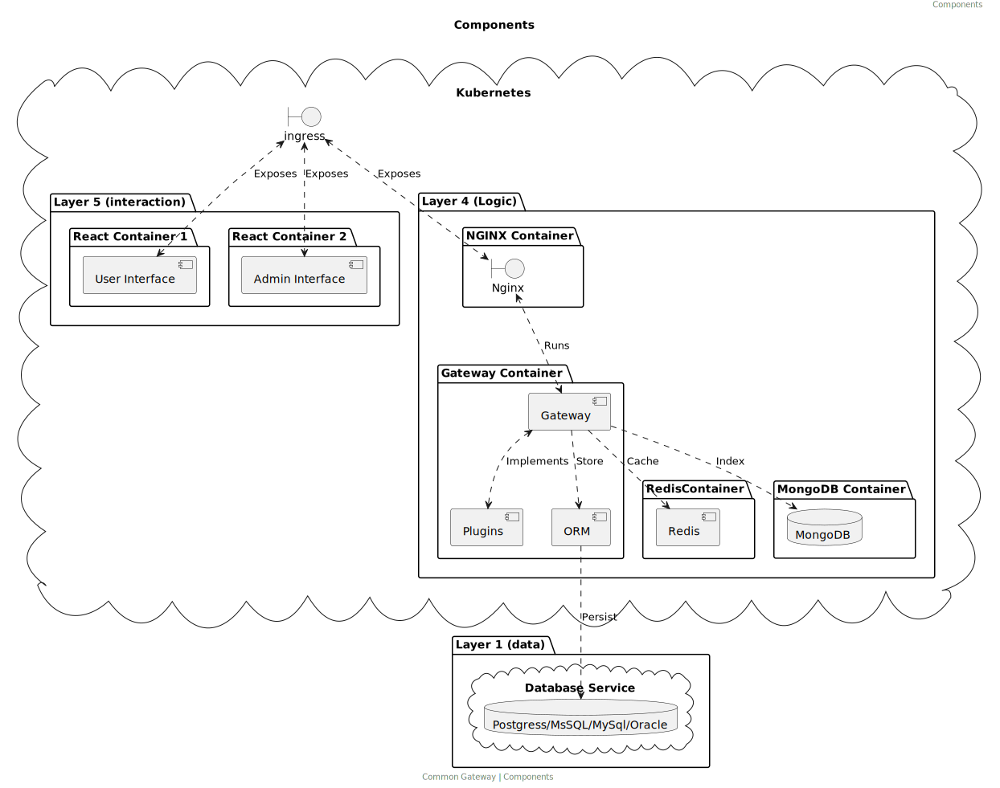
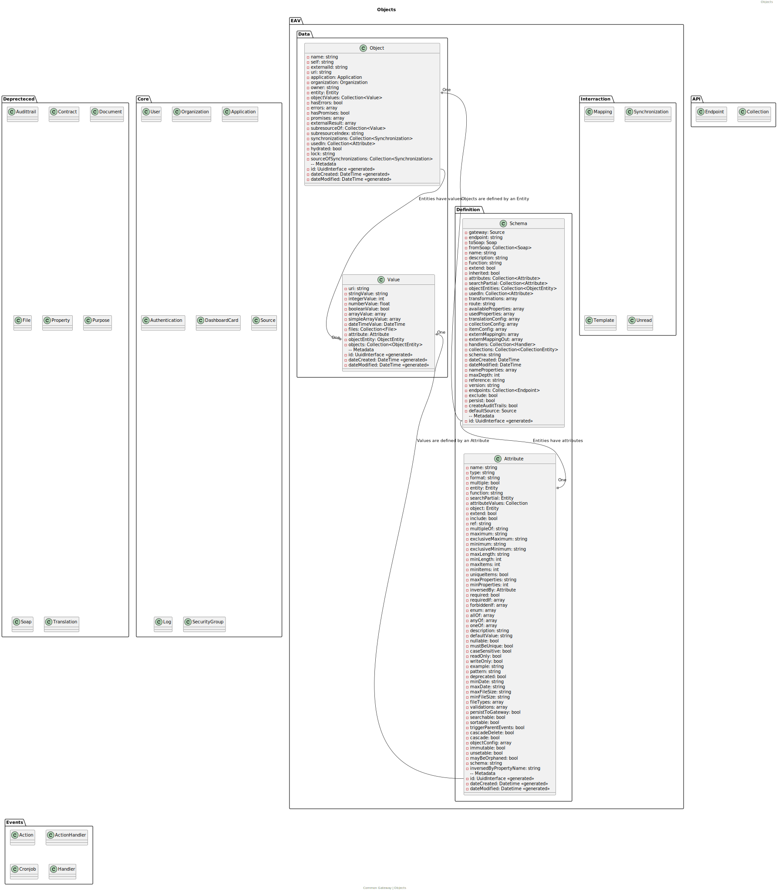

# Architecture

> **Warning**
> This file is maintained at the Conduction [Google Drive](https://docs.google.com/document/d/1RkIn8-mVD2I2v0HDMiPuHvoeitpWvcp0EVZyeFZHAG8/edit). Please make any suggestions of alterations there.

## Main Process

The Common Gateway is designed to handle a multitude of request types. Upon receiving a request, the Gateway commences a series of steps to handle the request and provide an appropriate response. The main process is as follows:

1.  **Receipt of Request:** The Gateway can receive a wide range of request types. These include:
    HTTP GET, PUT, POST, etc., containing a JSON, XML, or SOAP object
    A browser GET request (HTML)
    A user posting a form
    A user downloading a file
2.  **Endpoint Identification:** Once the Gateway receives a request, the first task is to identify the endpoint. The endpoint is a primary determinant of how the request will be processed. Endpoints are mapped to specific functions or services in the Gateway, and the identified endpoint dictates the necessary operations to be performed.
3.  **Response Generation:** After the request has been processed according to the rules of the identified endpoint, the Gateway generates an appropriate response. This could be a JSON or XML response for API requests, an HTML page for browser requests, or the requested file for download requests.

This main process forms the backbone of the Common Gateway's operation. It ensures that any incoming request can be accurately interpreted and handled, and that an appropriate response can be generated and returned to the user.

The use of endpoints allows the Gateway to be highly flexible and adaptable, capable of handling a wide variety of requests and responses, making it an ideal solution for various use cases.

Main request components

1.  [Endpoint](Endpoints.md)
2.  [Source](Sources.md)
3.  [Datalayer](Datalayer.md)
4.  [Request Service](../classes/Service/RequestService.md)
5.  [Events](Events.md)

## Two codebases to rule them all

As part of our ongoing efforts to improve and streamline our development process, we're transitioning from a single codebase setup to a library-based one. This shift involves migrating code from the existing repository at [ConductionNL/commonground-gateway](https://github.com/ConductionNL/commonground-gateway) to a new repository at [CommonGateway/CoreBundle](https://github.com/CommonGateway/CoreBundle).

This transition is not just about moving code; it's about enhancing the quality of our codebase. We're taking this opportunity to clean up both our code and documentation and to increase the coverage of our unit tests. However, this is a significant undertaking, and we're not finished yet. As of now, Entities, Controllers, and some workflows, including unit testing, are still located in the old repository. We expect the migration to be completed by summer 2023.

An integral part of this transition is the decoupling of client-specific code from the core codebase. This code will now reside in separate plugin repositories. This separation of concerns ensures a cleaner, more maintainable codebase, and allows for more customizable client implementations.

Please bear with us during this period of transition. We're confident that these changes will result in a more robust and efficient gateway, and we appreciate your understanding and patience during this time.

## Design Decisions

### API First

An API-first approach means that for any given development project, your APIs are treated as "first-class citizens." An API-first approach involves developing APIs that are consistent and reusable, which can be accomplished by using an API description language to establish a contract for how the API is supposed to behave. The specification we use is the [OpenAPI Specification](https://github.com/OAI/OpenAPI-Specification). You can view the latest version of this specification (3.0.1) on [GitHub](https://github.com/OAI/OpenAPI-Specification/blob/master/versions/3.0.1.md).

### Documentation

We host technical documentation on Read the Doc's and general user information on GitHub pages, to make the documentation compatible with GitHub we document in markdown (instead of reStructuredText). Documentation is part of the project and contained within the /docs folder.

### Common Ground

All applications are developed following the Common Ground standards on how a data exchange system should be: modular and open-source. More information on Common Ground can be found [here](https://commonground.nl/)

## Kubernetes set up

## Objects

