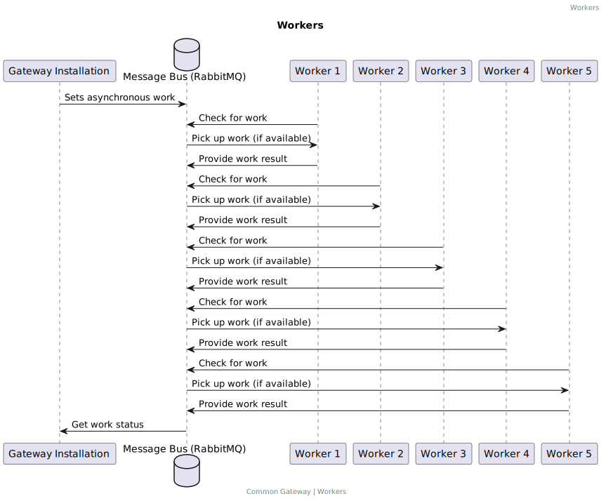

# Installation


> **Warning**
> This file is maintained at the Conduction [Google Drive](https://docs.google.com/document/d/1NfZQwcg7F6as3uMYguuxegASf5Bxsy84gveKNmWJ4OQ/edit). Please make any suggestions for alterations there.


We differ in the installation of the gateway between local en server installations, keep in mind that local installations are meant for development, testing en demo purposes and are (by their nature) not suited for production environments. When installing the gateway for production purposes ALWAYS follow the steps as set out under the server installation manual.

## Local installation

For our local environment, we use [docker desktop](https://www.docker.com/products/docker-desktop/). This allows us to spin up virtual machines that mimic production servers easily. In other words, it helps us ensure that the code we test/develop locally will also work online. The same can also be said for configurations.


To spin up the gateway for local use, you will need both [Docker Desktop](https://www.docker.com/products/docker-desktop/) and a [git client](https://gitforwindows.org/) (we like to use [git kraken](https://www.gitkraken.com/) but any other will suffice, you can also install [git](https://git-scm.com/) on your local machine)

**Steps**
1. Install [docker desktop](https://www.docker.com/products/docker-desktop/), [git client](https://gitforwindows.org/) and a browser like [google chrome](https://chromeenterprise.google/).
2. Create a folder where you want to install the gateway, for example: documents/gateway
3. Open a command line interface e.g. windows key + cmd + enter
4. Navigate to the folder you just created with our examples. This would be: `$ cd documents/gateway`
5. Git clone the Common Gateway repository to a folder on your machine (if you like to use the command line interface of git that's `git clone https://github.com/ConductionNL/commonground-gateway.git`
6. (optional) Check out a specific version of the gateway e.g. `git checkout feature/oc-ui`
7. Change the directory into the gateway folder (The folder where you also find the docker-compose.yml file) for example: `cd commonground-gateway`
8. Startup the gateway through `$ docker compose up`.
9. You should now see the gateway initiating the virtual machines it needs on your command line tool. (this might take some time on the first run, you will see the text ‘Ready to handle connection’ when it is ready to connect)
10. Additionally, you should now see the containers come up in your docker desktop tool (that you can use from here on)
11. When it is done you can find the Gateway API in your browser under [localhost](http://localhost/), the Gateway UI under [localhost:8000](http://localhost:8000), and any additional web apps that are part of your ecosystem under [localhost:81](http://localhost:81).
>__Note__: Read more about command line tools [here](https://developers.google.com/web/shows/ttt/series-2/windows-commandline) and how to [navigate](https://www.codecademy.com/learn/learn-the-command-line/modules/learn-the-command-line-navigation/cheatsheet)

**Troubleshooting**

If during the steps above you run into any problems the following tips might help:
- If during step 9 the text 'Ready to handle connection' does not appear (keep in mind, this might take a while!) and your docker desktop shows that the php-1 container is not in status running you could be running into an error. If this is the case check your command line tool for any error messages.
- For more general troubleshooting (relevant for local and server installation) please take a look at [troubleshooting](#troubleshooting)


## Server Installation

There are three main routes to install the Common gateway, but we advise using the [helm](https://helm.sh/) route for the Kubernetes environment. However, if you want, you can install the gateway on a Linux machine or use a docker-compose installation.

### Haven / Kubernetes
The Common Gateway is a Common Ground application built from separate components. To make these components optional, they are housed in separate [Kubernetes containers](https://kubernetes.io/docs/concepts/containers/). This means that a total installation of The Common Gateway requires several Containers. You can find which containers these are under [architecture](Architecture.md).


### Installation through Helm charts (recommended method)

> **Dependencies**
> - For installations on Kubernetes, you will need to install Helm v3 on your local machine.
> - If you need to install LetsEncrypt, you will also need to install `kubectl`, but if you previously installed Docker Desktop then `kubectl` is already present on your machine (so no installation needed).

### Haven installations
If you are installing the Common Gateway on a Haven environment, you can just run the provided Helm installer. Before installing the Common Gateway, you need to add it to your Helm repositories.

````helm
$ helm repo add common-gateway https://raw.githubusercontent.com/ConductionNL/commonground-gateway/main/api/helm/
````


After that, you can simply install the Gateway to your cluster using the Helm installer. If you are using a kubeconfig file to authenticate yourself, you need to add that as a --kubeconfig flag. However, if you are using another authentication method, you can omit the flag. When installing an application to Helm, always choose a name that helps you identify the application and put that in place of [my-installation].


````helm
$ helm install [my-gateway] common-gateway/commonground-gateway --kubeconfig=[path-to-your-kubeconfig] --namespace [namespace]
````

This will install the Gateway in a bare-bones and production setup on the latest version (you can lock versions through the version flag e.g. `--version 2.2)`. To further configure the Gateway, we need to set some environmental values. A full option list can be found [here](). Let's for now assume that you want to switch your Gateway from prod to dev-mode, enable cron-runners for asynchronous resource handling, add a domain name to make the Gateway publicly accessible, and last but not least, use LetsEncrypt to provide an SSL/HTTPS connection. In Helm, we use the `--set` flag to set values. So the total upgrade command would look like:

````helm
$ helm upgrade [my-gateway] --kubeconfig=[path-to-your-kubeconfig] --set gateway.enabled=true, pwa.apiUrl=https://[your-domain]/api, pwa.meUrl=https://[your-domain]/me, pwa.baseUrl=https://[your-domain], pwa.frontendUrl=https://[your-domain], pwa.adminUrl=https://[your-domain], ingress.enabled=true, global.domain=[your-domain], ingress.hostname=[your-domain], ingress.annotations.cert-manager\.io/cluster-manager=letsencrypt-prod, ingress.tls.0.hosts.0=[your-domain], ingress.tls.0.secretName=[your-domain but replace . with -]-tls, gateway.cronrunner.enabled=true
````

Or for the headless version

````helm
$ helm upgrade [my-gateway] common-gateway/commonground-gateway --kubeconfig=[path-to-your-kubeconfig] --set cronrunner.enabled=true,php.tag=dev,nginx.tag=dev,ingress.enabled=true,global.domain=[my-domain.com]
````

The helm install and upgrade commandos can also be put together:

````helm
$ helm upgrade [my-gateway] common-gateway/commonground-gateway --kubeconfig=[path-to-your-kubeconfig] --set cronrunner.enabled=true,php.tag=dev,nginx.tag=dev,ingress.enabled=true,global.domain=[my-domain.com] --namespace [namespace] --install
````

Alternatively, you can use the Kubernetes dashboard to change the Helm values file.

For more information on installing the application through Helm, read the [Helm documentation](https://helm.sh/docs/helm/).

### Non-Haven installations
If however, your environment is not compliant with the Haven standard (and we suggest that you follow it), then keep in mind that you need the following dependencies on your Kubernetes clusters:

**MUST have**
- [nfs](https://artifacthub.io/packages/helm/kvaps/nfs-server-provisioner)
- [Ingress-nginx](https://artifacthub.io/packages/helm/ingress-nginx/ingress-nginx)

**Should have**
- [Cert manager](https://artifacthub.io/packages/helm/cert-manager/cert-manager) (add `--set installCRDs=true` to the command if using Helm, you will need them for LetsEncrypt)
- LetsEncrypt (see details below)
- Prometheus
- Loki


### Activating LetsEncrypt.

If you want your cluster to be able to set up its own certificates for SSL/HTTPS (and save yourself the hassle of manually loading certificates), you can install LetsEncrypt. Keep in mind that this will provide low-level certificates. If you need higher-level certificates, you will still need to manually obtain them.

**Note: Make sure to install Cert Manager before LetsEncrypt**

````helm
$ kubectl apply -f letsencrypt-ci.yaml --kubeconfig=[path-to-your-kubeconfig]
````

### Installed dependencies
The common gateway relies on a number of software dependencies the helm chart installs alongside the common gateway. If you want however to connect to existing versions of these dependencies, you can disable them.

#### PostgreSQL
The common gateway is dependent on a SQL database for internal operations. We recommend to use PostgreSQL as the database type the common gateway was designed with. However we also support MySQL, MariaDB and Microsoft SQL Server, although the latter defers from newer standards and henceforth can cause some issues and therefore is not recommended.

To disable PostgreSQL: set the setting `postgresql.enabled` to `false`, and enter a SQL url (`pgsql://`, `psql://` for postgres, `mysqli://` for MySQL and MariaDB or `pdo_sqlsrv://`) in the field `postgresql.url`. Also, if the database is a Microsoft SQL Server database, don't forget to change the field `databaseType` to mssql.

The PostgreSQL database that is installed if `postgresql.enabled` is set to `true` is installed with [this chart](https://artifacthub.io/packages/helm/bitnami/postgresql/12.1.2). This chart contains default resource requests that are not overwritten.

In case the resource requests and/or limits have to be overridden this can be done using the following parameters:
```yaml
postgresql:
primary:
resources:
limits: {}
requests: {}
```
The default requests are 256Mi memory and 200m vCPU.


#### MongoDB
For serving content quickly the common gateway relies on a document cache which is run in MongoDB. MongoDB is also used to store the logs of the common gateway.

To disable MongoDB: set the setting `mongodb.enabled` to `false`, and enter a SQL url (`mongodb://`) in the field `mongodb.url`.

The MongoDB database that is installed if `mongodb.enabled` is set to `true` is installed with [this chart](https://artifacthub.io/packages/helm/bitnami/mongodb/13.4.4). This chart does not contain default resource requests, therefore the gateway chart overrides these requests with the following values:

```yaml
mongodb:
resources:
requests:
cpu: 1
memory: 6Gi
```

These limits are set to high limits to accommodate for large databases, and can be tweaked to lower values if the size of the database is not expected to exceed a couple of Gigabytes.

#### RabbitMQ
To run events from the event-driven architecture asynchronously, the common gateway uses a message queue on RabbitMQ.

The RabbitMQ dependency can be disabled by setting `rabbitmq.enabled` to `false`. However, it is not possible at this time to connect to an external instance of rabbitmq, this means that events cannot be run asynchronously, and that the workers have to be disabled by setting `consumer.replicaCount` to `0`.

The RabbitMQ message queue that is installed if `rabbitmq.enabled` is set to `true` is installed with [this chart](https://artifacthub.io/packages/helm/bitnami/rabbitmq/11.91.1). This chart does not contain default resource requests, therefore the gateway chart overrides these requests with the following values:

```yaml
rabbitmq:
resources:
requests:
cpu: 200m
memory: 256Mi
```

These are values that are not observed to be exceeded on busy environments with large numbers of asynchronous events.

#### Redis
For session storage and key value caching, a redis cache is in place.

The Redis dependency can be disabled by setting `redis.enabled` to `false`. However, it is not possible at this time to connect to an external instance of redis. This means that in order to have consistent session storage the common gateway can only be run on one container by setting the `replicaCount` parameter to `1`.

The Redis cache that is in stalled if `redis.enabled` is set to `true` is installed with [this chart](https://artifacthub.io/packages/helm/bitnami/redis/17.3.11). This chart does not contain default resource requests, therefore the gateway chart overrides these requests with the following values:

In case the resource requests and/or limits have to be overridden this can be done using the following parameters:
```yaml
redis:
master:
resources:
requests:
cpu: 20m
memory: 128Mi
```

#### Gateway UI
The common gateway also offers its own User Interface for admin.

This user interface is installed with [this chart](https://raw.githubusercontent.com/ConductionNL/gateway-ui/development/helm/).

The resource requests for these containers are set to:

```yaml
gateway-ui:
resources:
requests:
cpu: 10m
memory: 128Mi
```

> Note:
> With Helm, the difficulty often lies in finding all possible configuration options. To facilitate this, we have included all options in a so-called values file, which you can find [here](https://artifacthub.io/packages/helm/commonground-gateway/commonground-gateway?modal=values). One very common value used when installing the gateway through helm is the value --set global.domain={{your domain here}}.

### Installation through docker compose
The gateway repository contains a docker compose, and a .env file containing all setting options. These are the same files that are used for the local development environment. However when using this route to install the gateway for production you **MUST** set the `APP_ENV` variable to 'PROD` (enabling caching and security features) and you must change all passwords  (conveniently labeled _!ChangeMe!_) **NEVER** run your database from docker compose, docker compose is non-persistent and you will lose your data. Always use a separately managed database solution.

### Installation through composer (Linux / Lamp)
Before starting a Linux installation make sure you have a basic LAMP setup, you can read more about that [here](https://www.digitalocean.com/community/tutorials/how-to-install-linux-apache-mysql-php-lamp-stack-ubuntu-18-04). Keep in mind that the gateway also has the following requirements that need to be met before installation.

Linux extensions
Composer
PHP extensions
A message queue in the form of [RabbitMQ](https://www.rabbitmq.com/).
A caching mechanism in the form of [Redis](https://redis.io/)

After making sure you meet the requirement you can install the gateway through the following steps.

In your Linux environment create a folder for the gateway (`md /var/www/gateway`) and navigate to that folder (`cd /var/www/gateway`).
Then run either `$ composer require common-gateway/core-bundle` or the composer require command for a specific plugin.


## Troubleshooting
During installation, it is possible that you run into problems, below you will find common problems and how to deal with them. If you are still running into problems after reading this or if you have any constructive criticism please seek contact with our development team (info@conduction.nl).
> Note: when troubleshooting you will, in most cases, need to run some commands. Unless stated otherwise, these commands should always be executed in the php container.

A very common way to check why the Common Ground Gateway is not functioning as expected is by running the `bin/console doctrine:schema:validate` command. This command validates the mappings of the Commonground Gateway database, but will often return insightful error messages when running into other problems.

**You have requested a non-existent service**

This is an error message you will only get when you are trying to install & initialize [plugins](Plugins.md) on the CommonGround Gateway. If you get the error message "You have requested a non-existent service" then this indicates in most cases that you are missing a specific plugin, if you have already installed this plugin (or tried to) however, your config/bundles.php file is most likely not up-to-date. This bundles.php file should contain all installed bundles. If you, for example, get a message that `OpenCatalogi\OpenCatalogiBundle\ActionHandler\ComponentenCatalogusApplicationToGatewayHandler` does not exist, you most likely need to add `OpenCatalogi\OpenCatalogiBundle` to the bundles.php file like this: `OpenCatalogi\OpenCatalogiBundle\OpenCatalogiBundle::class => ['all' => true],` locally you can just edit this file, with a server installation you might want to use something like [vi editor](https://www.redhat.com/sysadmin/introduction-vi-editor) for this.

## Adding the gateway to your existing Symfony project (Beta)
The gateway is a Symfony bundle and can also be added directly to an existing Symfony project through composer. The basic composer command is `composer require commongateway/corebundle` and you can read more about the installation process on [packagist](https://packagist.org/packages/commongateway/corebundle).

## Applications
There are several applications that make use of Common Gateway installation as a backend, best known are [huwelijksplanner (HP)](https://github.com/huwelijksplanner), [Klantinteractie Service Systeem(KISS)](https://github.com/Klantinteractie-Servicesysteem) en [Open Catalogi (OC)](https://opencatalogi.nl/).


By design front ends are run as separate components or containers (see Common Ground layer architecture). That means that any frontend application using the gateway as a backend for frontend (BFF) should be installed separately.

## Production

The gateway is designed to operate differently in a production, than in a development environment. The main difference is the amount of caching and some security settings.

## Cronjobs and the cronrunner

The gateway uses cronjobs to fire repeating events (like synchronizations) at certain intervals. Users can set them up and maintain them through the admin UI. However, cronjobs themselves are fired through a cron runner, meaning that there is a script running that checks every x minutes (5 by default) whether there are cronjobs that need to be fired. That means that the execution of cronjob is limited by the rate set in the cronrunner .e.g if the cronrunner runs every 5 minutes it's impossible to run cronjobs every 2 minutes.

For docker compose and helm installation the cron runner is based on the Linux crontab demon and included in the installation scripts. If you are installing the gateway manually you will need to set up your own crontab to fire every x minutes.


For your crontab, you need to execute the ` bin/console cronjob:command` cli command in the folder where you installed the Common Gateway. e.g. `*/5 * * * * /srv/api bin/console cronjob:command`. If you need help defining your crontab we advise [crontab.guru](https://crontab.guru/every-5-minutes).

## Workers

The gateway uses workers to asynchronously handle workload, the concept is quite simple the gateway installation sets asynchronous works on a massage queue ([RabbitMQ](https://www.rabbitmq.com/)) other gateway installations then look into the message queue to see if there is any work that they can pick up. In the default helm installation, we use 5 gateway containers for this. The amount of workers is however configurable through the `change.me` parameter.



If you are installing the gateway on a Linux setup you will need to manually install workers (preferably on other machines than your main gateway installation) and put them into worker mode by running the command 'bin/console messenger:consume async', and point them to the [RabbitMQ](https://www.rabbitmq.com/) message queue. The RabbitMQ location is defined in the file api/config/messenger.yaml in the variable parameters.env(MESSENGER_TRANSPORT_DSN).

## Setting up plugins

After you install the Commonground Gateway, you can use the Commonground Gateway as it is, or take a look at plugins. More about plugins can be found [here](Plugins.md)


