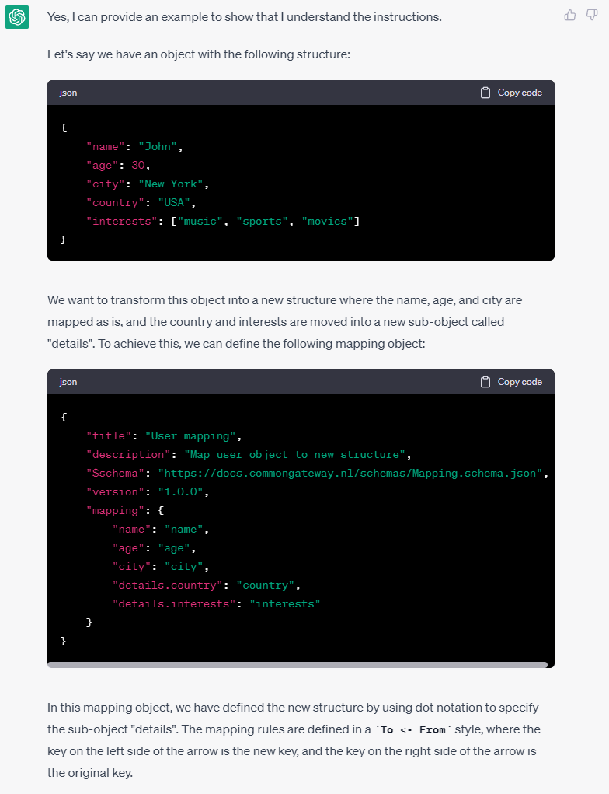

# Mappings

> **Warning**
> This file is maintained at the Conduction [Google Drive](https://docs.google.com/document/d/1BCrL4u2Ov_815QyH4tQH_roQGM0_Ia4QUyqMtXjlV1g/edit). Please make any suggestions or alterations there.

The mapping service supports the process of changing the structure of an object. It's used to transform data when the source doesn't match the desired data model. Mapping is done by a series of mapping rules in a To <- From style. In simple mapping, the position of a value within an object is changed.

**Index**
1. [Defining a mapping](#defining-a-mapping)
2. [Usage](#usage)
3. [Advanced (Twig) mapping and/or adding key's](#advanced-twig-mapping-andor-adding-keys)
4. [Pass Through and/or dropping key's](#pass-through-andor-dropping-keys)
5. [Working with conditional data](#working-with-conditional-data)
6. [Sub mappings ](#sub-mappings)
7. [Casting (Forcing) the type/format of values](#casting-forcing-the-typeformat-of-values)
8. [Special Casting (Forcing) change of values](#special-casting-forcing-change-of-values)
9. [Translating values](#translating-values)
10. [Renaming Keys](#renaming-keys)
11. [Order of mapping](#order-of-mapping)
12. [What if I can't map?](#what-if-i-cant-map)

## Defining a mapping

The Common Gateway stores,imports and exports mappings as JSON mapping objects. Bellow you can find an example mapping object

```json
{
  "title": "MyMapping",
  "description": "MyMapping",
  "$id": "https://development.zaaksysteem.nl/mapping/xxllnc.XxllncCaseToZGWZaak.mapping.json",
  "$schema": "https://docs.commongateway.nl/schemas/Mapping.schema.json",
  "version": "0.0.1",
  "passTrough": false,
  "mapping": {
    "{{to_key}}": "{{from_key}}"
  },
  "unset": ["{{from_key}}"],
  "cast": {
    "{{to_key}}": ["{{type}}"]
  }
}

```
Mapping objects MUST follow the bellow specifications

| Property    | Required | Usage                                                                                                       | Allowed Value                                                                                                                                                                                                                                                                                                                                                                                                          |
|-------------|----------|-------------------------------------------------------------------------------------------------------------|------------------------------------------------------------------------------------------------------------------------------------------------------------------------------------------------------------------------------------------------------------------------------------------------------------------------------------------------------------------------------------------------------------------------|
| title       | Yes      | User friendly single sentence describing of the mappings used for identification                            | string, max 255 characters                                                                                                                                                                                                                                                                                                                                                                                             |
| description | No       | User friendly multi line description of the mapping used for explaining purpose and workings of the mapping | string, max 2555 characters                                                                                                                                                                                                                                                                                                                                                                                            |
| $id         | No       | Used during the import of mappings to see if a mapping is already present                                   | string, max 255 characters                                                                                                                                                                                                                                                                                                                                                                                             |
| $schema     | Yes      | Tells the common gateway that this object is a mapping                                                       | Always: 'https://docs.commongateway.nl/schemas/Mapping.schema.json'                                                                                                                                                                                                                                                                                                                                                    |
| version     | no       | Used during the import of mappings to see if mapping should be overwritten (updated)                        | A valid [semantic version number](https://semver.org/lang/nl/)                                                                                                                                                                                                                                                                                                                                                         |
| passTrough  | no       | Determines whether to copy the old object to the new object                                                 | A boolean, default to false                                                                                                                                                                                                                                                                                                                                                                                            |
| mapping     | no       | Moves property positions in an object                                                                       | An array where the key is the new property location(in [dot notation](https://grasshopper.app/glossary/data-types/object-dot-notation/#:~:text=Dot%20notation%20is%20one%20way,%3A%205%2C%20%7D%3B%20console)) and the value the current property location (in [dot notation](https://grasshopper.app/glossary/data-types/object-dot-notation/#:~:text=Dot%20notation%20is%20one%20way,%3A%205%2C%20%7D%3B%20console)) |
| unset       | no       | Unset unused properties                                                                                     | A valid json object, read [more]() about using unset                                                                                                                                                                                                                                                                                                                                                                   |
| cast        | no       | Casts properties to a specific type                                                                         | A valid json object, read [more]() about using cast                                                                                                                                                                                                                                                                                                                                                                    |

## Usage
Okay, let's take a look at the most commonly used example api ([petstore](https://petstore.swagger.io/#/pet/findPetsByStatus)) and a basic original object.

```json
{
  "id": "0d671e30-04af-479a-926a-5e7044484171",
  "name": "doggie",
  "status": "available"
}
```

Now let's say we want to move the status into a new object that has a sub object called metadata, like this:

```json
{
  "id": "0d671e30-04af-479a-926a-5e7044484171",
  "name": "doggie",
  "metadata":{
    "status": "available"
  }
}
```

Then we need to create a mapping that copies the  property to a new location trough mapping, like this:

```json
{
  "title": "A simple mapping for animals",
  "$schema": "https://docs.commongateway.nl/schemas/Mapping.schema.json",
  "mapping": {
    "id": "id",
    "name": "name",
    "metadata.status": "status"
  }
}
```

So what happened under the hood? How is de status moved? Let's take a look at the first mapping set

```json
{
  "mapping": {
    "id": "id",
    "name": "name",
    "metadata.status": "status"
  }
}
```

Rules are carried out as a `To <- From` pair. In this case, the `metadata.status` key has a `status`  value. When interpreting what the description is, the mapping service has two options:

* The value is either a dot notation array pointing to another position in the object (see [dot notation](https://grasshopper.app/glossary/data-types/object-dot-notation/#:~:text=Dot%20notation%20is%20one%20way,%3A%205%2C%20%7D%3B%20console)). If so, then the value of that position is copied to the new position. (Under the hood the gateway uses [PHP dot notation to](https://github.com/adbario/php-dot-notation) achieve this result)
* The value is not a dot notation array to another position in the object (see dot notation), then the value is rendered as a [twig](https://twig.symfony.com/) template.

> **Note**
> - The key is ALWAYS treated as a dot notation telling the service where to move the properties content to.
> - Mapping object MUST have a title and $schema definition, and SHOULD have a description.
> - It is not necessary to declare every step of the array (e.g. metadata, metadata.status, metadata.status.name) just declaring the property where you want it will create the in between array key’s

Keep in mind that dot notations have no maximum depth, so an original object like:

```json
{
  "id": "0d671e30-04af-479a-926a-5e7044484171",
  "name": "doggie",
  "status": "available"
}
```

Could be mapped like:

```json
{
  "title": "A simple mapping",
  "$schema": "https://docs.commongateway.nl/schemas/Mapping.schema.json",
  "mapping": {
    "id": "id",
    "name": "name",
    "metadata.status.name": "status"
  }
}
```

To a new object:

```json
{
  "id": "0d671e30-04af-479a-926a-5e7044484171",
  "name": "doggie",
  "metadata":{
    "status":{
      "name": "available"
    }
  }
}
```

> **Note**
> - Using dot notation to move values around within an object will NOT cause the value to change or be converted. In other words you can move an entire array or sub object around by simply moving the property that it is in. Also, booleans will remain booleans, integers remain integers etc.
> - In the case that a key has a dot in it, and you don’t want it to trigger the array pointing with dot notation you can use the ASCII code for a dot instead. Example: “location.first.name” if you want first.name to be a string (just to show what I mean: “location.’first.name’”) it is possible to do this: “location.first&#46;name”. For more options like this, see: https://www.freeformatter.com/html-entities.html.

## Advanced (Twig) mapping and/or adding key's

Another means of mapping is Twig mapping. Let's look at a more complex mapping example to transform or map out data. The petstore decided that we would like to assign pets to an aisle, there are three aisle (green, blue and red) and every pet needs to be assigned randomly. That means that we need business logic in our mapping. fortunately we can use [twig](https://twig.symfony.com/doc/2.x/) logic in our mapping by placing it in  {{}} braces. that means that we can do this in our mapping

```json
{
  "name": "A simple mapping",
  "$schema": "https://docs.commongateway.nl/schemas/Mapping.schema.json",
  "mapping": {
    "id": "id",
    "name": "name",
    "status": "status",
    "aisle": "{{ random([green, blue , red]) }}"
  }
}
```

To turn this orignal object:

```json
{
  "id": "0d671e30-04af-479a-926a-5e7044484171",
  "name": "doggie",
  "status": "available"
}
```

Into this new object:

```json
{
  "id": "0d671e30-04af-479a-926a-5e7044484171",
  "name": "doggie",
  "status": "available",
  "aisle": "red"
}
```
As you might have noticed we have now added a key that wasn't present in the old object. That is because the mappings simply copies values into the new object. These values MAY be created on the fly trough use of the twig extension.

> **Note**
> - Both dot-notation and twig-based mapping are valid to move value's around in an object. BUT Dot-notation is preferred performance-wise.
> - It is possible to add key's by just declaring them

## Pass Through and/or dropping key's
In the above examples we are mapping a lot of properties into our new object that stay in the same location as the where in hour old object. e.g. `id`,`name`,`status`. You can spot these in our mapping:

```json
{
  "name": "A simple mapping",
  "$schema": "https://docs.commongateway.nl/schemas/Mapping.schema.json",
  "mapping": {
    "id": "id",
    "name": "name",
    "status": "status"
  }
}
```

If we have large objects this might be a lot of work (we would need to map EVERY value). This is where `passTrough` comes to our rescue. When setting `passTrough` to `true` in our mapping all the data from the original object is copied to ouw new objects (passed through the mapper). So if we want our object to stay exactly the same we can simply do the following mapping.

```json
{
  "name": "A simple mapping",
  "$schema": "https://docs.commongateway.nl/schemas/Mapping.schema.json",
  "passthrough": true
}
```

Now that's just going to give us exactly the same object, so let's add a simple bit of mapping. And we should see something interesting happening.

```json
{
  "title": "A simple mapping",
  "$schema": "https://docs.commongateway.nl/schemas/Mapping.schema.json",
  "passthrough": true,
  "mapping": {
    "metadata.status.name": "status"
  }
}
```

Will turn this original object:

```json
{
  "id": "0d671e30-04af-479a-926a-5e7044484171",
  "name": "doggie",
  "status": "available"
}
```

Into this new object:

```json
{
  "id": "0d671e30-04af-479a-926a-5e7044484171",
  "name": "doggie",
  "status": "available",
  "metadata":{
    "status":{
      "name": "available"
    }
  }
}
```

Okay, so we now have a double `status` that is because the mapper always copies a value from the old key position to the new key position. So if we are using passTrough we will copy that value twice (once through the mapper and once trough passthrough). To solve this we will need to manually unset the undesired key. Which we can do with a mapping like:

```json
{
  "title": "A simple mapping",
  "$schema": "https://docs.commongateway.nl/schemas/Mapping.schema.json",
  "passthrough": true,
  "mapping": {
    "metadata.status.name": "status"
  },
  "unset":["status"]
}
```

Which wil turn this original object:

```json
{
  "id": "0d671e30-04af-479a-926a-5e7044484171",
  "name": "doggie",
  "status": "available"
}
```
Into this new object

```json
{
  "id": "0d671e30-04af-479a-926a-5e7044484171",
  "name": "doggie",
  "metadata":{
    "status":{
      "name": "available"
    }
  }
}
```

> **Note**
> - Using passthrough represents a security risk. All values make it to the new object, so it should only be used on trusted or internal objects
> - passthrough is applied BEFORE mapping, so a mapping can be used to 'overwrite' values that where passed through
> - Normally when using passthrough we would like to clean up the result because we tend to end up with double data.
> - Dropping keys is always the second last action performed in the mapping process (before casting).
> - Unset should contain an `array` of key's, key's are defined in [dot notation](https://grasshopper.app/glossary/data-types/object-dot-notation/#:~:text=Dot%20notation%20is%20one%20way,%3A%205%2C%20%7D%3B%20console). So its possible to remove properties from any place within an object.

## Working with conditional data

Twig natively supports many [logical operators](https://twig.symfony.com/doc/3.x/templates.html), but a few of those are exceptionally handy when dealing with mappings. For example, concatenating
strings like {{ 'string 1' ~ 'string 2' }} which can be used as the source data inside the mapping

```json
{
  "title": "A simple mapping",
  "$schema": "https://docs.commongateway.nl/schemas/Mapping.schema.json",
  "passthrough": true,
  "mapping": {
    "metadata.color": "{{ \"The color is \" ~ color }}"
  },
  "unset": ["color"]
}
```

The same is achieved with [string interpolation](https://twig.symfony.com/doc/1.x/templates.html#string-interpolation) via a mapping of:


```json
{
  "title": "A simple mapping",
  "$schema": "https://docs.commongateway.nl/schemas/Mapping.schema.json",
  "passthrough": true,
  "mapping": {
    "metadata.color": "{{ \"The color is #{color} \" }}"
  },
  "unset": ["color"]
}
```


Both turn this original object:

```json
{
  "id": "0d671e30-04af-479a-926a-5e7044484171",
  "name": "doggie",
  "color": "blue"
}
```

Into this new object

```json
{
  "id": "0d671e30-04af-479a-926a-5e7044484171",
  "name": "doggie",
  "metadata": {
    "color": "The color is blue"
  }
}
```
Another useful twig take is the if statement. This can be used to check if a values exists in the first place in our mapping

```json
{
  "title": "A simple mapping",
  "$schema": "https://docs.commongateway.nl/schemas/Mapping.schema.json",
  "passthrough": true,
  "mapping": {
    "metadata.color": " {{color}}  unknown "
  },
  "unset": ["color"]
}
```

or to check for specific values in our mapping

```json
{
  "title": "A simple mapping",
  "$schema": "https://docs.commongateway.nl/schemas/Mapping.schema.json",
  "passthrough": true,
  "mapping": {
    "metadata.color": " pink "
  },
  "unset": ["color"]
}
```

## Sub mappings

In some cases you might want to make use of mappings that you have created before with the mapping you are currently defining. Common cases include mapping an array of sub objects or dividing your mapping into smaller files for stability and maintenance purposes.

To do this you can access the mapping service from within a mapping trough twig like:


```json
{
  "title": "A simple mapping",
  "$schema": "https://docs.commongateway.nl/schemas/Mapping.schema.json",
  "passthrough": true,
  "mapping": {
    "color": "{{ color|map(‘{reference}’, {array}) }}"
  }
}
```


The mapping service takes three arguments:
- reference [required]: Either the reference of the mapping that you want to use
- array [required]: The actual data that you want to map
- list [optional, defaults to false]: Set this to true if you want to map as a list (of objects) instead of its entirety (as one object).

## Casting (Forcing) the type/format of values
In some cases you might want to change the properties variable type or if you are using twig rendering, mapping output will always change all the values to `string`. For internal gateway traffic, this isn’t problematic, as the data layer will cast values to the appropriate outputs. When sending data to an external source, having all Booleans cast to strings might be bothersome. To avoid this predicament, we can force the datatype of your values by ‘casting’ them.

We can cast values by including a cast property in our mapping, the following type casts are currently available:

| Cast           | Function (php docs)                                                                    | Twig   |
|----------------|----------------------------------------------------------------------------------------|--------|
| string         | [php Type Juggling](https://www.php.net/manual/en/language.types.type-juggling.php)    | No     |
| bool / boolean | [php Type Juggling](https://www.php.net/manual/en/language.types.type-juggling.php)    | No     |
| int / integer  | [php Type Juggling](https://www.php.net/manual/en/language.types.type-juggling.php)    | No     |
| float          | [php Type Juggling](https://www.php.net/manual/en/language.types.type-juggling.php)    |  No     |
| array          | [php Type Juggling](https://www.php.net/manual/en/language.types.type-juggling.php)    | No     |
| date           | [php date function](https://www.php.net/manual/en/function.date)                       |  No     |
| url            | [php urlencode function](https://www.php.net/manual/en/function.urlencode.php)         |  Yes   |
| rawurl         | [php rawurlencode function](https://www.php.net/manual/en/function.rawurlencode.php)   |  Yes   |
| base64         | [php base64-encode function](https://www.php.net/manual/en/function.base64-encode.php) |  Yes   |
| json           | [php json-encode function](https://www.php.net/manual/en/function.json-encode.php)     |  Yes   |
| jsonToArray    | [php json-decode function](https://www.php.net/manual/en/function.json-decode.php)     |  Yes   |

That means that we can write a mapping like

```json
{
  "title": "A simple mapping",
  "$schema": "https://docs.commongateway.nl/schemas/Mapping.schema.json",
  "passthrough": true,
  "cast": {
    "age": ["int"],
    "available": ["bool"]
  }
}
```

To turn this original object:

```json
{
  "id": "0d671e30-04af-479a-926a-5e7044484171",
  "name": "doggie",
  "age": "2",
  "available": "yes"
}
```

Into the new object

```json
{
  "id": "0d671e30-04af-479a-926a-5e7044484171",
  "name": "doggie",
  "age": 2,
  "available": true
}
```

> **Note**
> - Beware what functions PHP uses to map these values and if the cast should be possible (or else an error is thrown).
> - Casting is always the last action performed by the mapping service


## Special casting (Forcing) change of values
In some rarer cases you might want to not 'just cast to a different type' but change a value entirely, these casts do not match with just one specific php cast or php function but contain more than one line of code. In most normal cases when you want to cast to (for example) an integer you would only use one cast `["integer"]` but with these cast it isn't unusual to combine multiple casts such as `["jsonToArray", "unsetIfValue=="]`.

We can change values by including a cast property in our mapping, the following special casts are currently available:

| Cast                    | Description                                                                                                                                                                                               |
|-------------------------|-----------------------------------------------------------------------------------------------------------------------------------------------------------------------------------------------------------|
| nullStringToNull        | This cast checks if the value equals string = 'null' and casts it to actual null.                                                                                                                         |
| coordinateStringToArray | This cast converts a coordinate string to an array of coordinates.                                                                                                                                        |
| keyCantBeValue          | This cast checks if the value equals the property name and if so, unsets the property.                                                                                                                    |
| unsetIfValue            | This cast checks if the value equals a specific value and if so, unsets the property. An example: `"unsetIfValue==example`. This can also be used to check if the value is empty with `"unsetIfValue=="`. |

That means that we can write a mapping like


```json
{
  "title": "A more complex mapping",
  "$schema": "https://docs.commongateway.nl/schemas/Mapping.schema.json",
  "passthrough": false,
  "mapping": {
    "doggies": "{{ map(‘{reference}’, subMapping, true)|json_encode }}\"\""
  },
  "cast": {
    "doggies": ["jsonToArray", "unsetIfValue=="]
  }
}
```


To turn this original object:

```json
{
  "id": "0d671e30-04af-479a-926a-5e7044484171",
  "name": "example",
  "doggies": null
}
```

Into the new object

```json
{
  "id": "0d671e30-04af-479a-926a-5e7044484171",
  "name": "example"
}
```

Or to turn this original object:

```json
{
  "id": "0d671e30-04af-479a-926a-5e7044484171",
  "name": "example2",
  "doggies": [
    {
        "name": "doggie",
        "description": "<- renamed to note by the subMapping",
        "age": 2
    }
  ]
}
```

Into the new object

```json
{
  "id": "0d671e30-04af-479a-926a-5e7044484171",
  "name": "example2",
  "doggies": [
    {
      "name": "doggie",
      "note": "<- renamed to note by the subMapping",
      "age": 2
    }
  ]
}
```


## Translating values

Twig natively supports [translations](https://symfony.com/doc/current/translation.html),  but remember that translations are an active filter `|trans`. And thus should be specifically called on values you want to translate. Translations are performed against a translation table. You can read more about configuring your translation table [here]().


The base for translations is the locale, as provided in the localization header of a request. When sending data, the base is in the default setting of a gateway environment. You can also translate from a specific table and language by configuring the translation filter e.g. {{ 'greeting' | trans({}, `[table_name]`, `[language]`) }}


The following mapping:


```json
{
  "title": "A simple mapping",
  "$schema": "https://docs.commongateway.nl/schemas/Mapping.schema.json",
  "passthrough": true,
  "mapping": {
    "color": "{{source.color|trans({},\"colors\") }}"
  }
}
```


Wil turn this original object:

```json
{
  "id": "0d671e30-04af-479a-926a-5e7044484171",
  "name": "doggie",
  "color": "blue"
}
```

Into this new object (on locale nl):

```json
{
  "id": "0d671e30-04af-479a-926a-5e7044484171",
  "name": "doggie",
  "color": "blauw"
}
```

If we want to force German (even if the requester asked for a different language), we'd map like


```json
{
  "title": "A simple mapping",
  "$schema": "https://docs.commongateway.nl/schemas/Mapping.schema.json",
  "passthrough": true,
  "mapping": {
    "color": "{{source.color|trans({},\"colors\".\"de\") }}"
  }
}
```


And get the following new object:

```json
{
  "id": "0d671e30-04af-479a-926a-5e7044484171",
  "name": "doggie",
  "color": "Blau"
}
```

> **Note**
> - In most cases request won't be originating from a browser, so its best to ALWAYS define the language that you would like to use


## Renaming Keys

The mapping doesn't support the renaming of keys directly but can rename keys indirectly by moving the data to a new position and dropping the old position (is we are using passThrough).

For example, we could write a mapping like:

```json
{
  "title": "A simple mapping",
  "$schema": "https://docs.commongateway.nl/schemas/Mapping.schema.json",
  "passthrough": true,
  "mapping": {
    "title": "name"
  },
  "unset": [
    "name"
  ]
}
```

To turn this original object:

```json
{
  "id": "0d671e30-04af-479a-926a-5e7044484171",
  "name": "doggie",
  "color": "blue"
}
```

Into this new object

```json
{
  "id": "0d671e30-04af-479a-926a-5e7044484171",
  "title": "doggie",
  "color": "blue"
}
```
## Order of mapping

The mapping service always handles all mappings in the following order

1. passTrough
2. mapping
3. unset
4. cast

## What if I can't map?

Even with all the above options, it might be possible that the objects you are looking at are too different to map. In that case, don't look for mapping solutions. If the old and new object are to differend, add them to the data layer and write a [plugin]() to keep them in sync based on actions.

## Using ChatGDP
Mappings are mostly bassed on comparing the original object you have and the new object you require the actual, or in other word comparing statuses and writing something to get from original to new. In practice this is a pretty straight forward process that can easily be left to online AI's (like ChatGDP) to write the firts version for you. Simply head over to [https://chat.openai.com/](https://chat.openai.com/) and start a prompt to let chat GDP know what you want to do.

We generally ask it to ``Can you provide an new example based on the mapping service?  [copy past this readme from start to passTrough]``, like:


ChatGDP should now explain to you how it would create mappings.



Oke so now we have ChatGDP setup, we can as it to create mappings for us. Let's ask it te create a simple mapping for us

Normally we would ask something like this:

Can you create a mapping from this original object
```json
{
  "id": "0d671e30-04af-479a-926a-5e7044484171",
  "name": "doggie",
  "color": "blue"
}
```

Into the following new object
```json
{
  "id": "0d671e30-04af-479a-926a-5e7044484171",
  "name": "doggie",
  "metadata":{
    "color": "blue",
    "dateCreated": "use twig to create a time stamp"
  }
}
```
based on the mapping service

[copy past this readme from start to passTrough]


And, presto! ChatGDP writes a basic mapping for us


> **Note**
> - Conveniently ChatGDP provides a copy code button in the right top of the codding example that allows us to simply download the provided mapping an import it into the gateway.
> - We cut the above screenshots short for layout reasons but be sure to include as much from the mapping readme as you can
> - Always check the code that ChatGDP provided! It is known to make errors ;)


