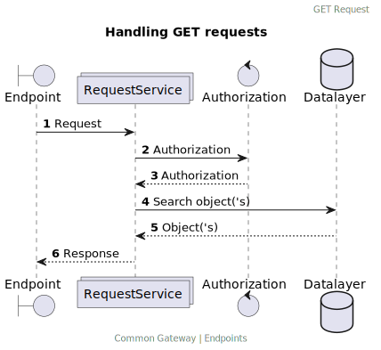
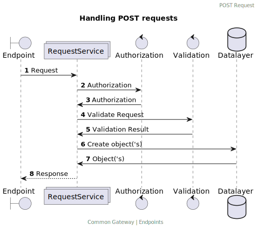
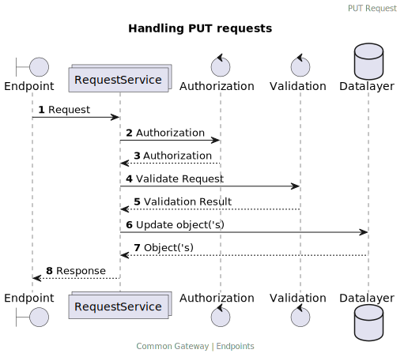

# Endpoint


> **Warning**
> This file is maintained at the Conduction [Google Drive](https://docs.google.com/document/d/1b0yGB1Q_IR27ik8XUurdFq9VUFqTWC62P-ZhZZF62EI/edit). Please make any suggestions or alterations there.

Endpoints are locations (with addresses)  where applications can send and receive messages. The generally consist of a domain and path part together forming an URL. For example in case of  the `demo.commongateway.nl/api/pets` url, the `/api/pets` would be the path and and `demo.commongateway.nl/` the domain.

The common gateway uses endpoint to allow applications to access it, it splits al endpoints into two categories wich are separated by their first path part.

/admin for endpoints that are part of the gateways internal workings
/api for user created endpoints

**Index**
1. [Defining an endpoint](#defining-an-endpoint)

## Defining an endpoint

The Common Gateway stores,imports and exports endpoints as JSON mapping objects. Bellow you can find an example endpoint object

```json

```
Endpoint objects MUST follow the bellow specifications

| Property     | Required | Usage                                                                                                                                                                                                                                             | Allowed Value                                                                                                                                           |
|--------------|----------|---------------------------------------------------------------------------------------------------------------------------------------------------------------------------------------------------------------------------------------------------|---------------------------------------------------------------------------------------------------------------------------------------------------------|
| title        | Yes      | User friendly single sentence describing of the endpoint used for identification                                                                                                                                                                  | string, max 255 characters                                                                                                                              |
| description  | No       | User friendly multi line description of the endpoint used for explaining purpose and workings of the mapping                                                                                                                                      | string, max 2555 characters                                                                                                                             |
| $id          | No       | Used during the import of endpoint to see if a endpoint is already present                                                                                                                                                                        | string, max 255 characters                                                                                                                              |
| $schema      | Yes      | Tells the common gatway that this object is a endpoint                                                                                                                                                                                            | Always: 'https://docs.commongateway.nl/schemas/Endpoint.schema.json'                                                                                    |
| version      | no       | Used during the import of endpoint to see if endpoint should be overwritten (updated)                                                                                                                                                             | A valid [semantic version number](https://semver.org/lang/nl/)                                                                                          |
| pathRegex    | no       | The regex used by the Gateway to find the endpoint. For the above  example, that would be `^pets`, but the regex could also allow for variable parts like `^pets/?([a-z0-9-]+)?$`. The pathRegex **MUST** be unique within a Gateway installation |                                                                                                                                                         |
| path         | no       | An array of the items in the path that are separated by` /` in the endpoint. For the above example that would be `[‘pets’,’id’]`. Path parts **MUST** exist of letters and numbers.                                                               |                                                                                                                                                         |
| pathParts    | no       | An array containing the parts of the path for setting variables for later processes to use later on. Based on their index in the path array and the variable’s name that should be created. For the above example, that would be `[‘1’=>’id’]`    |                                                                                                                                                         |
| methods      | no       | Determins the HTTP methods suported by this endpoint                                                                                                                                                                                              | An array of the methods that are allowed on this path, for example [‘GET’,’PUT’,’POST’,’PATCH’,’DELETE’]. An endpoint **must** have at least one method |
| source       | no       | Turns the endpoint into a proxy for a differend API                                                                                                                                                                                               | ONE external source that is proxied by the endpoint (see Proxy)                                                                                                                                                        |
| schemas      | no       | Any schemas provided by the endpoint (see schema’s)                                                                                                                                                                                               | Array of schema's                                                                                                                                       |
| throws       | no       | Any events thrown by the endpoint (see event-driven)                                                                                                                                                                                              | Array of events thrown when the endpoint is called                                                                                                      |


## Handling incoming traffic

Once an endpoint is called by an external application  calls an endpoint(or user, a browser is also an application), the endpoint will handle the following actions in the following order. 


## Proxy

An endpoint MAY be a proxy for another (external) source. In this case, the endpoint will forward all traffic to the external source (and attach authorisation if required by that source). It will also pass along:
any headers
, query parameters
, body
, and methods (e.g., GET)
sent to the endpoint. Keep in mind that it will only do so if the method used is activeated on the endpoint (in practice, it is quite common not to expose delete through an endpoint)

Suppose the endpoint path contains an endpoint parameter in the path regex e.g. `example`. In that case, it will also forward that message to that specific endpoint on the external source. So `gateway.com/api/petstore/pets` would be forwarded to   `petstore.com/pets`.

AKeep in mind that a proxy does not transform or translate data, it simply forwards the received request to a source and thenthan returns the response of that source. If you require more functionality (e.g. data transformation or translations) you should set upsetup a schema.

## Schema's

If an endpoint connects is connected to one or more schemas, it will try to handle the traffic based on the requested service. The endpoint will continue in its handling order if no schema’s are defined.


If an endpoint is hooked to schema(‘s) it will automatically create an API and appropriate Redoc based on its settings. See API for more information on the API.
It is possible to hook an endpoint to multiple schemas. When hooked to multiple schemas, the endpoint can still handle POST requests, BUT a POST request must include a valid _self.scheme.id or _self. scheme.ref that refers to the appropriate schema so that the endpoint understands what schema you are trying to create.
If an endpoint is hooked to more than one entity, it will render search results from all linked entities based on supplied queries.

### GET


### POST


### PUT
Put request are handled roughly  the same as an POST request, with one exception. 
1. On a PUT request an exisiting object wil be entirely replaced by the new object. Values that where present in the original object but are not present in the new object wil be DELETED.



### PATCH
Put request are handled roughly the same as an PUT request, with two exception. 
1. On a PATCH request an exisiting object wil be updated  by the new object. Values that where present in the original object but are not present in the new object wil be KEPT.
2. Validity will of the request will be determend afther merging the original and new object. e.g. a required value dosn't need to be pressent in an patch request if it was already present in the original object. Assuming that the orignal object already had al required values (or else it could note have been created) a patch requests only required value should be it's id (excpetion being that the object definition could have been changed afther the original object was created)


### DELETE


## Throwing Events

If no proxy or entity(s) are provided, the endpoint will throw events(such as listen) as listen under throws. The endpoint will continue in its handling order if no throws are defined.

When the endpoint throws events, it generates a response in the call cache. After handling all the throws ,are handled it will return the response to the user. The response starts as a `200 OK` “your request has been processed”, but may be altered by any action that subscribed to a thrown event may alter it.

Any action can subscribe to an event thrown by an endpoint, but common examples are proxy en request actions. These fulfill the same functionality as the direct proxy or event link but allow additional configuration, such as mapping.

## Return an error

The endpoint will return an error if no proxy, entities, or throws are defined.

## Security

Endpoints MAY be secured by assigning them to user groups. This is done on the basis of methods.  


